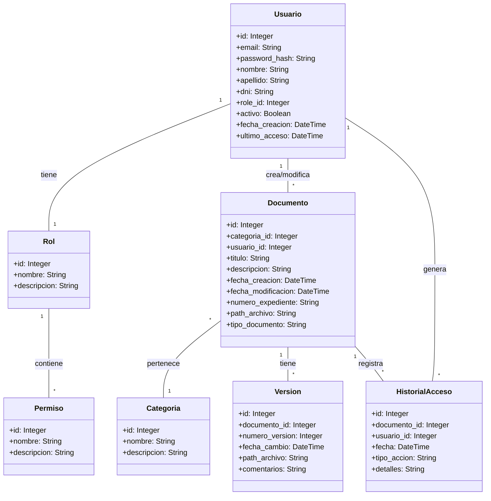

# Diagrama de Clases - Sistema de Gestión Documental

## Descripción de las Relaciones

1. **Usuario - Rol**: Uno a uno, cada usuario tiene exactamente un rol que define sus permisos en el sistema. Los roles predefinidos son:
   - Administrador: Control total del sistema
   - Gestor de Documentos: Gestión documental
   - Usuario de Consulta: Solo lectura (rol por defecto)

2. **Rol - Permiso**: Uno a muchos, cada rol tiene un conjunto definido de permisos que determinan qué acciones pueden realizar los usuarios con ese rol.

3. **Usuario - Documento**: Uno a muchos, un usuario puede crear/modificar múltiples documentos.

4. **Documento - Categoria**: Muchos a uno, muchos documentos pueden pertenecer a una categoría.

5. **Documento - Version**: Uno a muchos, un documento puede tener múltiples versiones.

6. **Usuario/Documento - HistorialAcceso**: Uno a muchos, registra todas las acciones realizadas sobre documentos por usuarios.

## Notas Importantes
- Los documentos tienen un sistema de versionado para mantener un historial de cambios
- Se mantiene un registro detallado de accesos y modificaciones para auditoría
- El sistema de permisos es flexible y basado en roles
- Los documentos pueden ser categorizados y etiquetados para mejor organización