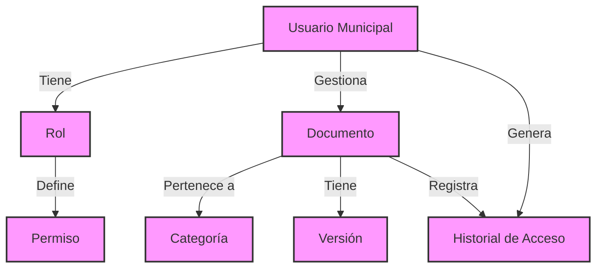

# Modelo de Dominio - Sistema de Gestión Documental

## Narrativa del Sistema

El Sistema de Gestión Documental de la Municipalidad de Lules es una plataforma diseñada para digitalizar y gestionar eficientemente la documentación municipal. El sistema permite a los funcionarios municipales cargar, buscar, modificar y acceder a documentos de manera controlada y segura.

Cada documento en el sistema representa un expediente o documento oficial que necesita ser preservado y gestionado. Los documentos pueden ser ordenanzas, resoluciones, expedientes, notas, etc. Cada uno mantiene un historial de versiones para asegurar la trazabilidad de los cambios.

Los usuarios del sistema tienen roles específicos que determinan sus permisos de acceso y modificación. Por ejemplo, algunos usuarios solo pueden consultar documentos, mientras que otros tienen la capacidad de cargar nuevos documentos o modificar los existentes.

Para mantener el orden y facilitar la búsqueda, los documentos se organizan en categorías y pueden etiquetarse con palabras clave. Además, cada acción realizada en el sistema queda registrada en un historial de acceso, permitiendo auditar quién realizó qué acción y cuándo.

## Modelo de Dominio

## Flujos Principales

1. **Gestión de Documentos**
   - Carga de nuevos documentos
   - Actualización de documentos existentes
   - Versionado automático
   - Categorización y etiquetado

2. **Búsqueda y Consulta**
   - Búsqueda por metadatos
   - Filtrado por categorías
   - Acceso según permisos

3. **Auditoría y Control**
   - Registro de acciones
   - Histórico de cambios
   - Trazabilidad de modificaciones

4. **Administración**
   - Gestión de usuarios
   - Asignación de roles
   - Configuración de permisos