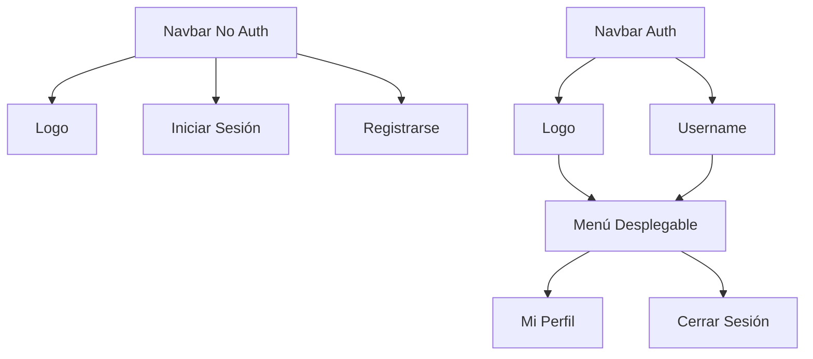

# HU004: Navbar con Estado de Autenticación

## Descripción
Como usuario del sistema
Quiero ver mi estado de autenticación en la barra de navegación
Para saber si estoy logueado y qué acciones puedo realizar

## Criterios de Aceptación

### 1. Visualización del Estado No Autenticado
Dado que soy un visitante no autenticado
Cuando accedo a cualquier página del sistema
Entonces debo ver en la barra de navegación:
- Logo/Nombre del sistema a la izquierda
- Botón "Iniciar Sesión" a la derecha
- Botón "Registrarse" a la derecha del botón "Iniciar Sesión"

### 2. Visualización del Estado Autenticado
Dado que soy un usuario autenticado
Cuando accedo a cualquier página del sistema
Entonces debo ver en la barra de navegación:
- Logo/Nombre del sistema a la izquierda
- Mi nombre de usuario a la derecha
- Un menú desplegable junto a mi nombre que incluye:
  - Mi perfil
  - Cerrar sesión

### 3. Persistencia del Estado
Dado que estoy autenticado
Cuando navego entre diferentes páginas del sistema
Entonces mi estado de autenticación debe mantenerse consistente
Y no debo tener que volver a iniciar sesión

### 4. Cerrar Sesión
Dado que estoy autenticado
Cuando selecciono "Cerrar sesión" del menú desplegable
Entonces debo ser desconectado del sistema
Y la barra de navegación debe actualizarse al estado no autenticado
Y debo ser redirigido a la página principal

### 5. Responsive Design
Dado que accedo desde diferentes dispositivos
Cuando la pantalla es más pequeña que 768px
Entonces la barra de navegación debe adaptarse:
- Mostrar un botón de menú hamburguesa
- Colapsar las opciones en un menú desplegable
- Mantener la misma funcionalidad en formato móvil

## Detalles Técnicos

### Frontend
- Componente React para la barra de navegación (`Navbar.tsx`)
- Estado global de autenticación usando React Context
- LocalStorage para persistir el token JWT
- Interceptores para manejar expiración del token
- CSS con diseño responsive y breakpoints

### Backend
- Endpoint para validar estado de sesión
- Manejo de tokens JWT para autenticación
- Endpoint para cerrar sesión (invalidar token)

## Mockups

## Flujo de Trabajo

1. Al cargar cualquier página:
   - Verificar existencia de token JWT
   - Validar token con el backend
   - Actualizar estado de autenticación
   - Renderizar navbar según estado

2. Al cerrar sesión:
   - Eliminar token JWT del localStorage
   - Limpiar estado de autenticación
   - Redireccionar a página principal

## Criterios de Implementación

### Seguridad
- Validar token en cada cambio de ruta
- Implementar refresh token para mantener sesión
- Limpiar datos sensibles al cerrar sesión

### UX/UI
- Feedback visual para acciones (hover, active)
- Transiciones suaves en menús desplegables
- Indicadores claros del estado de autenticación
- Consistencia con el diseño general del sistema

### Performance
- Lazy loading para componentes del menú
- Minimizar re-renders usando memo/useMemo
- Cachear estado de autenticación apropiadamente

## Dependencias
- HU001: Visualización de Página Principal
- HU002: Registro de Usuario Básico
- HU003: Login de Usuario